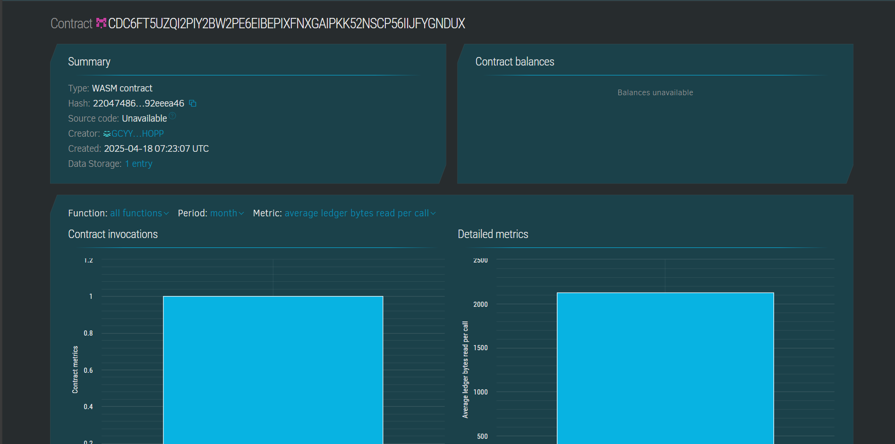

# NFT Transfer with Message

## Project Description

A lightweight Soroban smart contract that allows minting, transferring, and viewing NFTs, each attached with a personalized message. The contract tracks ownership and enables message updates during transfers.

---

## Project Vision

To create a simple yet powerful decentralized way to send NFTs with attached messages—ideal for digital greetings, art, and collectibles that carry emotion, meaning, or context with each transfer.

---
 
## Key Features
  
- ✅ **Mint NFT**: Any user can mint a new NFT and attach a message.
- 🔁 **Transfer with Message**: NFTs can be transferred to another user with a new message each time.
- 👁️ **View NFT**: Easily retrieve metadata of an NFT, including owner and messages .

---

## Future Scope

- 🖼️ Add support for metadata like images, traits, and categories.
- 🪙 Introduce royalties and transfer limits.
- 🔒 Implement permission layers for private message viewing.
- 📦 Connect with IPFS or decentralized storage for richer NFT content.

---
## Contract details
CDC6FT5UZQI2PIY2BW2PE6EIBEPIXFNXGAIPKK52NSCP56IIJFYGNDUX

